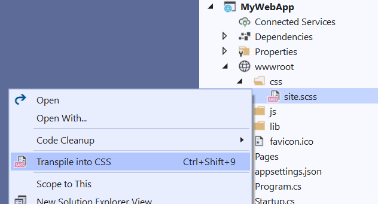
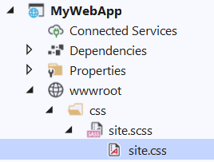

# Sass Compiler

Transpiles Sass/Scss files to CSS and minifies it instantly - every time you save the file

Download this extension from the [Marketplace](https://marketplace.visualstudio.com/items?itemName=MadsKristensen.SassCompiler)
or get the [CI build](https://www.vsixgallery.com/extension/SassCompiler.51aaf69f-7f00-426c-a697-64a2b5acabc3).

----------------------------------------------

Right-click any .scss or .sass file and hit **Transpile into CSS**

That will now register the transpiler as a *Custom Tool* for that file and generate a .css file nested behind it.

Every time you save the .scss file, a transpiled and minified .css file will be generated instantly.

## License
[Apache 2.0](LICENSE)